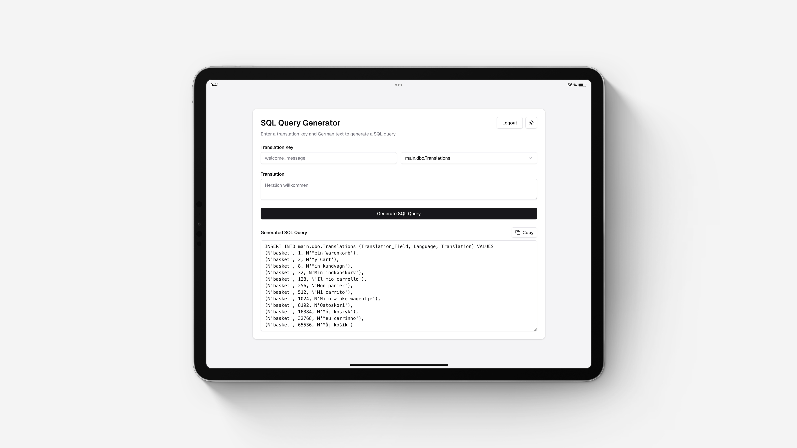

# SQL Query Generator

A **Next.js** application that converts translation keys and their values into SQL queries. The app uses AI to
generate multilingual queries that can be integrated directly into the database.



## Features

- **Multiple Languages:** Generate a query for various languages
- **AI-Powered Translations:** Translations are generated using ChatGPT
- **Database Selector:** Switch between different databases for dynamic queries
- **Secure Login:** Authentication via Supabase Auth

## Technologies

This project is built with:

- **Framework**: [Next.js](https://nextjs.org)
- **Styling**: [Tailwind CSS](https://tailwindcss.com)
- **Authentication**: [Supabase](https://supabase.com/)
- **Translation**: [GPT-4o mini](https://openai.com/)
- **Components**: [Shadcn](https://ui.shadcn.com)
- **Validation**: [Zod](https://zod.dev/)
- **Toasts**: [Sonner](https://sonner.emilkowal.ski/)
- **Icons**: [Lucide](https://lucide.dev/)

## Getting Started

Ensure you have **Node.js** installed, an **OpenAI** API key and an active **Supabase** user.

### Installation

1. Clone the repository:
   ```bash
   git clone https://github.com/benjaminpfleghaar/sql-query-generator.git
   ```

2. Install dependencies:
   ```bash
   npm install
   ```

3. Create a `.env.local.` file and provide credentials:
   ```plaintext
   NEXT_PUBLIC_SUPABASE_URL=<YOUR_URL>
   NEXT_PUBLIC_SUPABASE_ANON_KEY=<YOUR_KEY>
   OPENAI_API_KEY=<YOUR_KEY>
   ```

4. Update the database names and languages in `config.js`:
   ```js
   export const languages = {1: "German", 2: "English", ...};
   export const databases = ["myDatabase.Translations", "..."];
   ```

5. Run the application:
   ```bash
   npm run dev
   ```